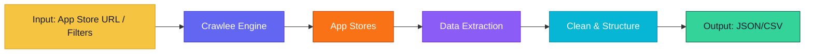
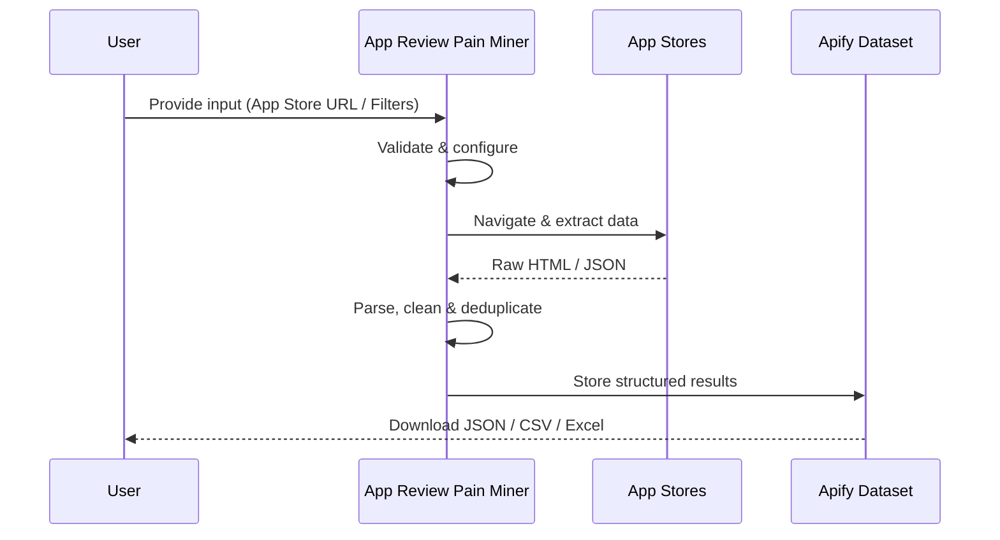
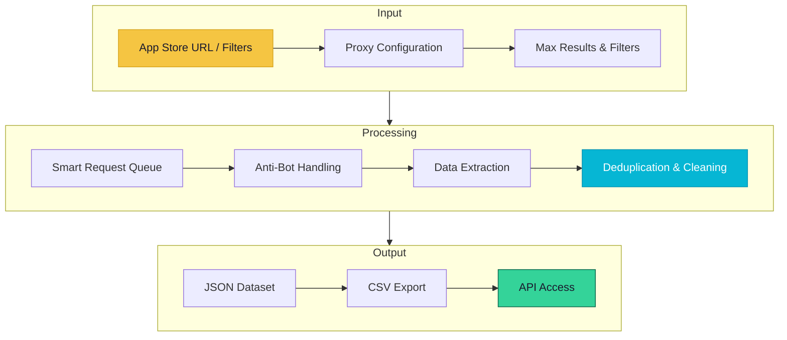

# App Review Pain Miner

> Extract and analyze app store reviews to discover user pain points, feature requests, and sentiment patterns

[](https://apify.com/george.the.developer/app-review-pain-miner)
[](https://github.com/the-ai-entrepreneur-ai-hub/app-review-pain-miner)
[](LICENSE)

---

## Overview

App Review Pain Miner scrapes reviews from the App Store and Google Play, then uses NLP-powered analysis to categorize feedback into pain points, feature requests, praise, and bugs. Get actionable product intelligence from thousands of reviews in minutes with automated sentiment scoring and keyword extraction.

   

---

## Architecture



---

## How It Works



**Step-by-step:**

1. **Input Validation** — Your configuration is validated and the scraping session is initialized with optimal proxy settings
2. **Smart Crawling** — Crawlee manages request queues, retries, and proxy rotation automatically for maximum reliability
3. **Data Extraction** — Structured data is parsed from each page using optimized selectors and anti-detection measures
4. **Deduplication** — Results are deduplicated and cleaned to ensure high data quality with no duplicates
5. **Output Delivery** — Clean, structured data is saved to your Apify dataset for download or API access

---

## Input Parameters

| Parameter | Type | Description |
|-----------|------|-------------|
| `appUrl` | `String` | App Store or Google Play URL |
| `maxReviews` | `Number` | Maximum reviews to analyze |
| `minRating` | `Number` | Minimum star rating (1-5) |
| `maxRating` | `Number` | Maximum star rating (1-5) |
| `language` | `String` | Filter reviews by language |

### Input Example

```json
{
  "appUrl": "https://apps.apple.com/app/id123456789",
  "maxReviews": 500,
  "minRating": 1,
  "maxRating": 3,
  "language": "en"
}
```

---

## Output Fields

| Field | Type | Description |
|-------|------|-------------|
| `reviewText` | `String` | Full review text |
| `rating` | `Number` | Star rating (1-5) |
| `author` | `String` | Reviewer username |
| `date` | `String` | Review date |
| `sentiment` | `String` | Sentiment: positive, negative, neutral |
| `category` | `String` | Pain point, feature request, bug report, praise |
| `keywords` | `Array` | Key topics mentioned |
| `appVersion` | `String` | App version reviewed |

### Output Example

```json
{
  "reviewText": "App crashes every time I try to export. Broken for 3 updates now.",
  "rating": 1,
  "author": "frustrated_user_42",
  "date": "2026-03-08",
  "sentiment": "negative",
  "category": "bug_report",
  "keywords": [
    "crash",
    "export",
    "data",
    "broken"
  ],
  "appVersion": "4.2.1"
}
```

---

## Use Cases

- **Product Development** — Identify common complaints to prioritize bug fixes and features
- **Competitive Intelligence** — Analyze competitor app reviews to find product gaps
- **Customer Success** — Monitor sentiment trends over time to measure satisfaction
- **Marketing Copy** — Extract real user language for authentic marketing messages

---

## Data Flow



---

## Pricing

This actor uses Apify's **Pay-Per-Event** pricing. You only pay for what you use.

| Event | Price | Description |
|-------|-------|-------------|
| `review-extracted` | $0.003 | Per review extracted and analyzed |
| `sentiment-analyzed` | $0.002 | Per NLP sentiment analysis |

> Free tier available on Apify. No credit card required to start.

---

## Getting Started

### Run on Apify Console

1. Go to [App Review Pain Miner on Apify Store](https://apify.com/george.the.developer/app-review-pain-miner)
2. Click **"Try for free"**
3. Configure your input parameters
4. Click **"Start"** and wait for results
5. Download your data as JSON, CSV, or Excel

### Run via API

```bash
curl -X POST "https://api.apify.com/v2/acts/george.the.developer~app-review-pain-miner/runs" \
  -H "Content-Type: application/json" \
  -H "Authorization: Bearer YOUR_API_TOKEN" \
  -d '{"appUrl":"https://apps.apple.com/app/id123456789","maxReviews":500,"minRating":1,"maxRating":3,"language":"en"}'
```

### Run with Python

```python
from apify_client import ApifyClient

client = ApifyClient("YOUR_API_TOKEN")
run = client.actor("george.the.developer/app-review-pain-miner").call(
    run_input={
    "appUrl": "https://apps.apple.com/app/id123456789",
    "maxReviews": 500,
    "minRating": 1,
    "maxRating": 3,
    "language": "en"
}
)

for item in client.dataset(run["defaultDatasetId"]).iterate_items():
    print(item)
```

---

## Tech Stack

| Technology | Purpose |
|------------|---------|
| **Node.js** | Runtime environment |
| **Crawlee** | Web scraping and crawling framework |
| **Cheerio** | Fast HTML parsing and data extraction |
| **Apify SDK** | Actor lifecycle, storage, and proxy management |

---

## Related Actors

More data extraction tools by [George The Developer](https://apify.com/george.the.developer):

- [Reddit Scraper Pro](https://apify.com/george.the.developer/reddit-scraper-pro) — Extract posts, comments, user profiles, and subreddit data from Reddit at scale 
- [AI Training Data Scraper](https://apify.com/george.the.developer/ai-training-data-scraper) — Collect structured, clean datasets from the web purpose-built for training machi
- [Influencer Marketing Intel](https://apify.com/george.the.developer/influencer-marketing-intel) — Discover and analyze social media influencers with engagement metrics, audience 
- [Google Maps Leads & Website Audit](https://apify.com/george.the.developer/google-maps-leads-website-audit) — Extract business leads from Google Maps with automated website audits for contac
- [TikTok Shop Affiliate Sales Scraper](https://apify.com/george.the.developer/tiktok-shop-affiliate-sales-scraper) — Extract TikTok Shop products, affiliate commissions, sales volumes, and trending

[View all actors on Apify Store >>>](https://apify.com/george.the.developer)

---

## Support

- **Apify Store**: [https://apify.com/george.the.developer/app-review-pain-miner](https://apify.com/george.the.developer/app-review-pain-miner)
- **GitHub Issues**: [Report a bug](https://github.com/the-ai-entrepreneur-ai-hub/app-review-pain-miner/issues)
- **Author**: [George The Developer](https://apify.com/george.the.developer)

---

## License

MIT License. See [LICENSE](LICENSE) for details.

---

*Built with Crawlee and the Apify SDK by [George The Developer](https://apify.com/george.the.developer). Star this repo if you find it useful!*
